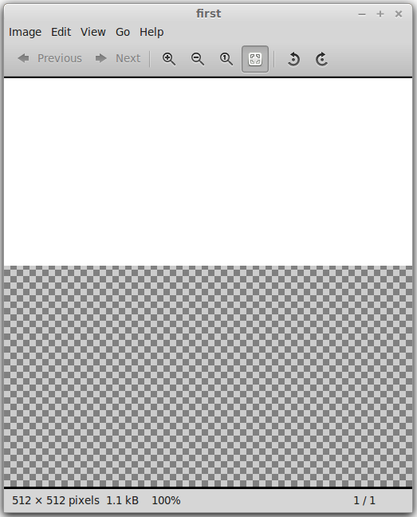
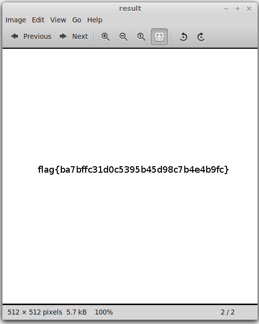

Разбор [задачек по bash](https://github.com/xairy/mipt-ctf/tree/master/01-intro/01-bash).

# Простые задачи

## simple

Воспользовавшись утилитой file, можно увидеть, что simple - это просто текстовый файл:
``` bash
$ file simple 
simple: ASCII text
```

Вывести его содержимое можно командой cat:
``` bash
$ cat simple 
flag{7dcdb5a749c7f5280762d65278bd678c}
```

Вот он флаг, осталось лишь его сдать.
Это можно сделать, используя только bash.

Для начала, с помощью cut вырежем сам флаг:
``` bash
$ cat simple | cut -c 6-37
7dcdb5a749c7f5280762d65278bd678c
```

Теперь припишем имя для турнирной таблицы и название задачи с помощью awk:
``` bash
$ cat simple | cut -c 6-37 | awk '{print "xairy simple " $0}'
xairy simple 7dcdb5a749c7f5280762d65278bd678c
```

А теперь отправим все это на сервер:
``` bash
$ cat simple | cut -c 6-37 | awk '{print "xairy simple " $0}' | nc andreyknvl.com 9998
Correct!
```

## dense

Посмотрим на тип файла dense:
``` bash
$ file dense 
dense: Zip archive data, at least v2.0 to extract
```

Файл является zip архивом, распакуем его:
``` bash
$ unzip dense
Archive:  dense
replace dense? [y]es, [n]o, [A]ll, [N]one, [r]ename: y
  inflating: dense
```

После распаковки получаем текстовый файл:
``` bash
$ file dense 
dense: ASCII text
$ head dense 
7a16c7c75ece6f37fc9f680ce990b1fd1bd43132f35d22546dbd8df88142f89a2a14b231602ec417
2fc42e4ed3a874e61d8c47cb19ff446a07b75fadb22095d106efe4c3f89a29755aafa578f1753872
6460b996852047fddf2405db2e765fb9f3b930ce4224ca9180b39230bee37d3ace7de3d2d19d2456
dbf61cc7b2e03ff142f42fd8f647f4134131c871fe8de273d1a9f5e0c892203cb95e6e44e517724b
48ba8832ad5b57d2d274831e63a7c200520de13f19ad1da09c4dd574a804a6f8c396a412062af8f6
0651d4cf54f051d58444de16f203436735718385c8ba71b53c39046255e62ab2dd918b1d660020ff
4dfe88570a7dfc0c7cac8764558426533756960bc4da6f1328c713a3dfd3caf7f4afbd2b29372201
8737870efdcf53131b02a427aabb5a101f4b9fa2ed7e37ba56d9d558176ea23002b7c87e30eb3d82
8cd725c5850af7f8e168a2519c27432e3bc0ea0a6c05e743933463e9add96207794b57850cd21556
556c3ae37ddbe7c910e9ddcd67a56aff142b469275bd94ec6e45d02bb5f81e7bf718d9654d9c69f5
```

Попробуем поискать в этом файле флаг:
``` bash
$ cat dense | grep "flag"
978f3eace7e625df532a43aflag{4bf47e277be11d43b6817748359b8074}fa305888c9c097e2cd7
```

Ага, нашли.
Далее вырезаем его с помощью cut, приписываем имя и название задачи с помощью awk и отправляем на сервер с помощью nc.

## apart

Посмотрим на тип файла apart:
```
$ file apart 
apart: XZ compressed data
```

Погуглив или почитав man, можно узнать, что XZ архив можно распаковать с помощью tar вот так:
``` bash
$ tar -xJf apart
```

Более того, умный tar может сам догадаться до формата архива:
``` bash
$ tar -xf apart
```

После распаковки мы видим папку с тремя файлами:
``` bash
$ cd apart
$ ls
first  second  third
```

Посмотрим на типы этих файлов:
``` bash
$ file *
first:  PNG image data, 512 x 512, 8-bit/color RGBA, non-interlaced
second: data
third:  data
```

Файл first является png изображением, но если попробовать его открыть, ничего интересного мы не увидим:
``` bash
$ eog first
```



Название задачи apart и названия файлов first, second и third намекают на то, что последние три файла - это один файл, разбитый на несколько частей.
Попробуем их склеить:
``` bash
$ cat first second third > result
$ file result 
result: PNG image data, 512 x 512, 8-bit/color RGBA, non-interlaced
$ eog result
```



Вот он флаг.
Остается перепечатать его руками и сдать.

## storage

Посмотрим на тип файла storage:
``` bash
$ file storage 
storage: SQLite 3.x database
```

Файл является SQLite 3 базой данных.
С помощью sqlite3 можно ее открыть и посмотреть на существующие в ней таблицы и данные, которые в них хранятся.
Возможно где-то среди них окажется флаг.

Мы пойдем другим путем.
Попробуем поискать флаги с помощью grep:
``` bash
$ cat storage | grep "flag"
Binary file (standard input) matches
```

Поскольку файл storage не является текстовым, то grep всего-лишь говорит, что искомая подстрока в нем присутствует, но ее не выводит.
Чтобы таки вывести ее необходимо добавить параметр -a:
``` bash
$ cat storage | grep -a "flag"
... flag{c51c3651849563e8bb155a3a0dec7584} ... flag{fe63444fa3ad3ce44ac71f96d90de998} ...
...
```

Посмотрев на вывод, можно заметить, что флагов в этом файле присутствует несколько, но не очень много.
Попробуем отправить на сервер сразу все найденные флаги, вдруг какой-нибудь из них окажется правильным.

Для начала нам нужно их из файла извлечь, избавившись от лишних символов.
Напишем для этого регулярное выражение и воспользуемся параметром -o, чтобы grep выводил только ту часть строки, которая соответствует регулярному выражению:
``` bash
$ cat storage | egrep -ao "flag\{[a-f0-9]{32}\}"
flag{c51c3651849563e8bb155a3a0dec7584}
flag{fe63444fa3ad3ce44ac71f96d90de998}
flag{944203f995d26e88fc19d7a3f236fa2b}
...
```

Теперь попробуем отправить все флаги на сервер:
``` bash
cat storage | egrep -ao "flag\{[a-f0-9]{32}\}" | cut -c 6-37 | awk '{print "xairy storage " $0}' | nc andreyknvl.com 9998
Bad flag!
...
Bad flag!
Correct!
Bad flag!
...
Bad flag!
```

Один из флагов оказался правильным, задача сдана.

## path

Посмотрим на тип файла path:
``` bash
$ file path 
path: gzip compressed data, from Unix, last modified: Mon Oct 20 15:59:46 2014
```

Распакуем его с помощью умного tar'а:
``` bash
$ tar -xf path
```

Внутри оказывается большое количество вложенных папок:
``` bash
$ cd path
$ ls
56fc  7c33  a209  ce03
```

Попробуем поискать в этих папках файлы:
``` bash
$ find . -type f
./7c33/cfd1/423d/7710/171f/1f00/d000/5d79/gotcha
```

Ага, нашли.
В самом файле не оказывется ничего полезного:
``` bash
$ cat ./7c33/cfd1/423d/7710/171f/1f00/d000/5d79/gotcha
 ______
< Wat? >
 ------
      \                    / \  //\
       \    |\___/|      /   \//  \\
            /0  0  \__  /    //  | \ \    
           /     /  \/_/    //   |  \  \  
           @_^_@'/   \/_   //    |   \   \ 
           //_^_/     \/_ //     |    \    \
        ( //) |        \///      |     \     \
      ( / /) _|_ /   )  //       |      \     _\
    ( // /) '/,_ _ _/  ( ; -.    |    _ _\.-~        .-~~~^-.
  (( / / )) ,-{        _      `-.|.-~-.           .~         `.
 (( // / ))  '/\      /                 ~-. _ .-~      .-~^-.  \
 (( /// ))      `.   {            }                   /      \  \
  (( / ))     .----~-.\        \-'                 .~         \  `. \^-.
             ///.----..>        \             _ -~             `.  ^-`  ^-_
               ///-._ _ _ _ _ _ _}^ - - - - ~                     ~-- ,.-~
                                                                  /.-~
```

Однако название задачи намекает, что флагом может быть путь до этого файла.
Проверяем:
```
$ nc andreyknvl.com 9998
xairy path 7c33cfd1423d7710171f1f00d0005d79
Correct!
```

Получилось, задача решена.

# Сложные задачи

Для решения этих задачек требовалось чуть больше знаний, чем давалось на паре.
Некоторые из задачек на темы, которые мы будем рассматривать в дальнейшем, поэтому не страшно, если их решения непонятны.

## flip

Посмотрим на тип файла flip:

```
$ file flip 
flip: ELF 64-bit LSB  executable, x86-64, version 1 (SYSV), dynamically linked (uses shared libs), for GNU/Linux 2.6.24, BuildID[sha1]=ebd136f0ec1a06e3da1fa8d9c71bf80b1d5a1bb8, not stripped
```

Это бинарный (исполняемый файл).

Иногда, некоторое представление о там, что же происходит внутри бинарника, можно получить, посмотрев какие строки в нем содержатся:

```
$ strings flip
/lib64/ld-linux-x86-64.so.2
libc.so.6
printf
__libc_start_main
__gmon_start__
GLIBC_2.2.5
UH-@
UH-@
[]A\A]A^A_
flag{%016llx%016llx}
;*3$"
```

Судя по строке "flag{%016llx%016llx}", бинарник должен напечатать флаг в соответствующем формате.

Посмотрим что происходит в функции main:

```
$ objdump -dC flip | grep "<main>" -A 21
000000000040059d <main>:
  40059d:	55                   	push   %rbp
  40059e:	48 89 e5             	mov    %rsp,%rbp
  4005a1:	53                   	push   %rbx
  4005a2:	48 83 ec 18          	sub    $0x18,%rsp
  4005a6:	c6 45 ef 00          	movb   $0x0,-0x11(%rbp)
  4005aa:	80 7d ef 00          	cmpb   $0x0,-0x11(%rbp)
  4005ae:	74 22                	je     4005d2 <main+0x35>
  4005b0:	e8 b0 ff ff ff       	callq  400565 <bar()>
  4005b5:	48 89 c3             	mov    %rax,%rbx
  4005b8:	e8 70 ff ff ff       	callq  40052d <foo()>
  4005bd:	48 89 da             	mov    %rbx,%rdx
  4005c0:	48 89 c6             	mov    %rax,%rsi
  4005c3:	bf 64 06 40 00       	mov    $0x400664,%edi
  4005c8:	b8 00 00 00 00       	mov    $0x0,%eax
  4005cd:	e8 3e fe ff ff       	callq  400410 <printf@plt>
  4005d2:	b8 00 00 00 00       	mov    $0x0,%eax
  4005d7:	48 83 c4 18          	add    $0x18,%rsp
  4005db:	5b                   	pop    %rbx
  4005dc:	5d                   	pop    %rbp
  4005dd:	c3                   	retq   
  4005de:	66 90                	xchg   %ax,%ax
```

В начале функции происходит бессмысленное сравнение 0 и 0 (инструкции по адресам 4005a6 и 4005aa), после чего происходит переход в конец функции (инструкция 4005ae).

Судя по всему блок кода, следующий сразу за инструкцией перехода, не исполняется.
В этом блоке кода происходит вызов функций foo() и bar() и их результат вместе со строкой формата передается функции printf().

Попробуем в дебаггере перейти на инструкцию, следующую сразу за инструкцией перехода:

```
$ chmod +x flip
$ gdb flip
GNU gdb (GDB) 7.8-gg2
...
Reading symbols from flip...done.
Loading v16/v17 libstdc++ pretty-printers ...
(gdb) break main
Breakpoint 1 at 0x4005a6: file flip.cpp, line 20.
(gdb) run
Starting program: /usr/local/google/home/andreyknvl/Downloads/ctf/flip 

Breakpoint 1, main () at flip.cpp:20
20	flip.cpp: No such file or directory.
(gdb) x/20i $pc
=> 0x4005a6 <main()+9>:	movb   $0x0,-0x11(%rbp)
   0x4005aa <main()+13>:	cmpb   $0x0,-0x11(%rbp)
   0x4005ae <main()+17>:	je     0x4005d2 <main()+53>
   0x4005b0 <main()+19>:	callq  0x400565 <bar()>
   0x4005b5 <main()+24>:	mov    %rax,%rbx
   0x4005b8 <main()+27>:	callq  0x40052d <foo()>
   0x4005bd <main()+32>:	mov    %rbx,%rdx
   0x4005c0 <main()+35>:	mov    %rax,%rsi
   0x4005c3 <main()+38>:	mov    $0x400664,%edi
   0x4005c8 <main()+43>:	mov    $0x0,%eax
   0x4005cd <main()+48>:	callq  0x400410 <printf@plt>
   0x4005d2 <main()+53>:	mov    $0x0,%eax
   0x4005d7 <main()+58>:	add    $0x18,%rsp
   0x4005db <main()+62>:	pop    %rbx
   0x4005dc <main()+63>:	pop    %rbp
   0x4005dd <main()+64>:	retq   
   0x4005de:	xchg   %ax,%ax
   0x4005e0 <__libc_csu_init>:	push   %r15
   0x4005e2 <__libc_csu_init+2>:	mov    %edi,%r15d
   0x4005e5 <__libc_csu_init+5>:	push   %r14
(gdb) jump *0x4005b0
Continuing at 0x4005b0.
flag{30fff0281c29cf0799d9fcaea77379a9}
[Inferior 1 (process 31785) exited normally]
```

Как и предполагалось, пропущенный блок кода печатает флаг.

## hidden

В файле hidden содержится текст:

```
$ file .hidden 
.hidden: ASCII text
$ cat .hidden 
666c61677b32313765303961666637636433346333346633376364313231346437663334377d
```

В этой задачке нужно было догадаться, что текст в файле - это шестнадцатиричное представление последовательности байт, каждые два символа - один байт.

Можно написать скрипт, который сконвертирует этот текст в читаемую строку.
На мой взгляд такие вещи нужно писать на Питоне, но, тем не менее, решение на bash выглядит таким образом:

```
$ echo -e `cat .hidden | sed 's/../\\\\x&/g'`
flag{217e09aff7cd34c34f37cd1214d7f347}
```

## order

Файл order является архивом. Распакуем:

```
$ file order 
order: POSIX tar archive (GNU)
$ tar -xf order
flip  order
```

Внутри оказывается большое количество файлов с непонятными именами:

```
$ cd order/
$ ls
02e74f10e0327ad868d138f2b4fdd6f0  6364d3f0f495b6ab9dcf8d3b5c6e0b01  c16a5320fa475530d9583c34fd356ef5
1679091c5a880faf6fb5e6087eb1b2dc  6512bd43d9caa6e02c990b0a82652dca  c20ad4d76fe97759aa27a0c99bff6710
182be0c5cdcd5072bb1864cdee4d3d6e  6ea9ab1baa0efb9e19094440c317e21b  c4ca4238a0b923820dcc509a6f75849b
19ca14e7ea6328a42e0eb13d585e4c22  6f4922f45568161a8cdf4ad2299f6d23  c51ce410c124a10e0db5e4b97fc2af39
1c383cd30b7c298ab50293adfecb7b18  70efdf2ec9b086079795c442636b55fb  c74d97b01eae257e44aa9d5bade97baf
1f0e3dad99908345f7439f8ffabdffc4  8e296a067a37563370ded05f5a3bf3ec  c81e728d9d4c2f636f067f89cc14862c
1ff1de774005f8da13f42943881c655f  8f14e45fceea167a5a36dedd4bea2543  c9f0f895fb98ab9159f51fd0297e236d
33e75ff09dd601bbe69f351039152189  98f13708210194c475687be6106a3b84  cfcd208495d565ef66e7dff9f98764da
34173cb38f07f89ddbebc2ac9128303f  9bf31c7ff062936a96d3c8bd1f8f2ff3  d3d9446802a44259755d38e6d163e820
37693cfc748049e45d87b8c7d8b9aacd  a5bfc9e07964f8dddeb95fc584cd965d  e369853df766fa44e1ed0ff613f563bd
3c59dc048e8850243be8079a5c74d079  a87ff679a2f3e71d9181a67b7542122c  e4da3b7fbbce2345d7772b0674a318d5
45c48cce2e2d7fbdea1afc51c7c6ad26  aab3238922bcc25a6f606eb525ffdc56  eccbc87e4b5ce2fe28308fd9f2a7baf3
4e732ced3463d06de0ca9a15b6153677  b6d767d2f8ed5d21a44b0e5886680cb9
```

Если посмотреть на содержимое этих файлов, то можно заметить, что в каждом файле содержится по одному символу:

```
$ cat *
e
2
d
9
3
d
6
a
a
d
3
1
f
3
c
8
6
5
d
8
7
5
}
{
e
6
0
d
l
d
5
a
0
f
c
4
1
g
```

Судя по наличию символов '{' и '}' и всех букв слова 'flag', из содержимого файлов можно составить строку 'flag{...}', которая и будет искомым флагом.
Вопрос в том, как именно упорядочить эти символы.

В этой задаче, нужно было догадаться, что имена файлов - это MD5 хэши.
Просто погуглив любое из них, можно увидеть, что хэшировались строки '0', '1', ..., '37'.
После сортировки символов по "расхэшированным" именам файлов мы получаем флаг.


## exploit

В этой задачке предполагалось попробовать найти уязвимость на сервере.
Известного мне решения у нее нет, но наверняка оно существует.

Как вариант, можно было попробовать найти уязвимость в сервисе, принимающем флаги, исходники которого [находятся в этом же репозитории](https://github.com/xairy/mipt-ctf/tree/master/scoreboard).
Кроме того, на сервере крутится несколько других сервисов, которые тоже представляют собой вектора атаки.
