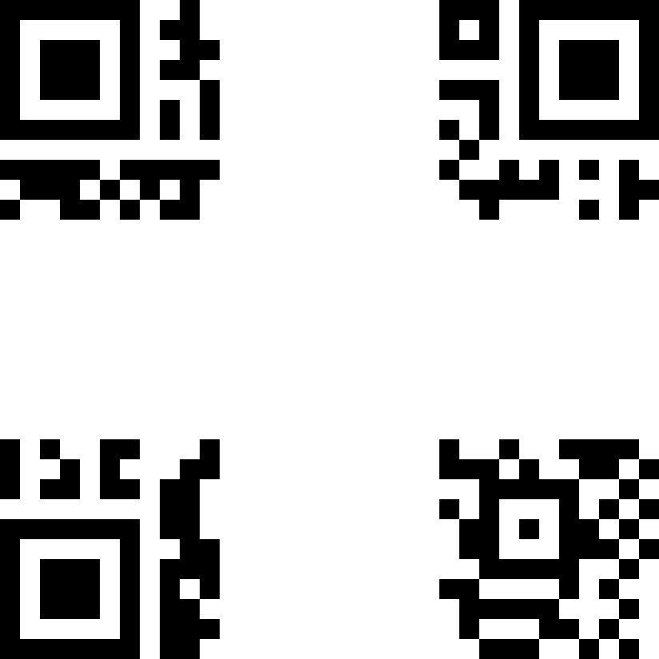
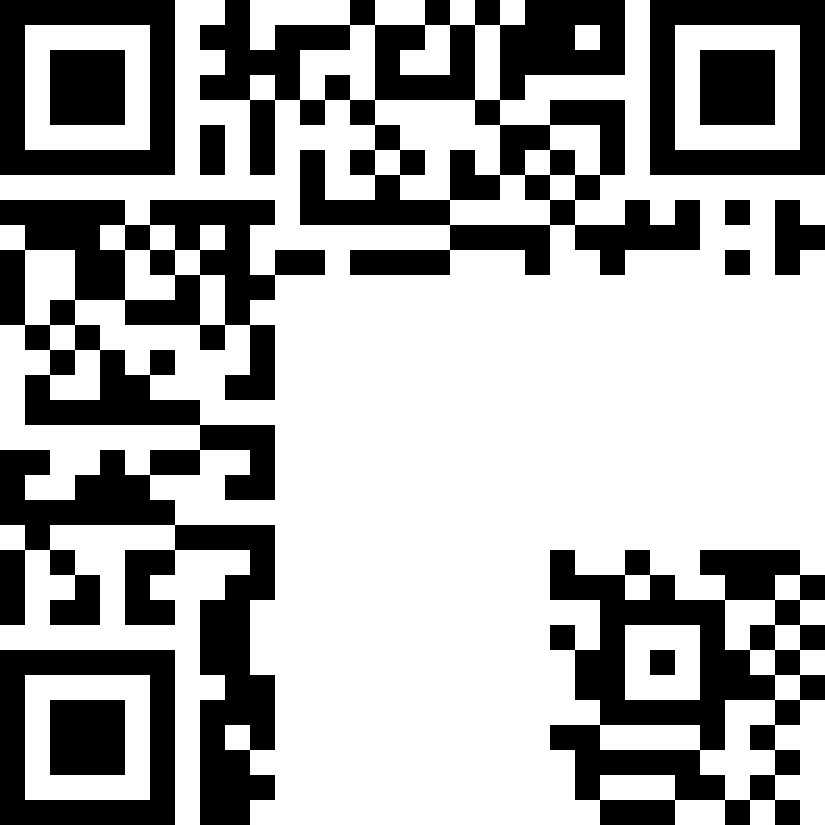
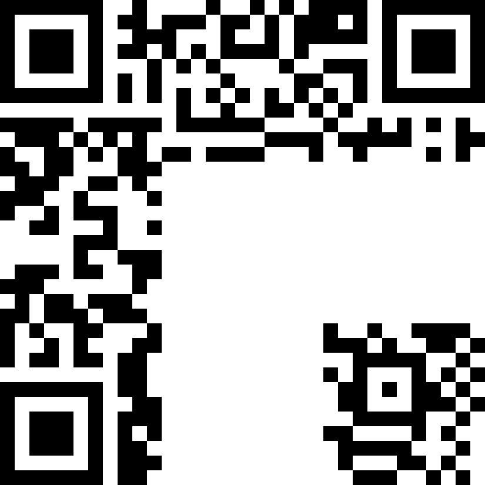

Разбор [задачек по python](https://github.com/xairy/mipt-ctf/tree/master/01-intro/02-python).

## Контест

Решения задачек с контеста лежат [здесь](https://github.com/xairy/mipt-ctf/tree/master/01-intro/02-python/contest).

## Simple

В программе происходит две проверки на корректность введенной строки.

Первая сравнивает `line[0::2]` (каждый второй символ исходной строки) с `faa8babcb4d573f1`.
Вторая сравнивает `line[-1:0:-2]` (каждый второй символ исходной строки в обратном порядке начиная с конца) с `bec86ad48f2419bf`.

Нужно восстановить строку из этих фрагментов.
Это можно сделать ручками, а можно воспользоваться тем же Питоном.

``` python
>>> a = 'faa8babcb4d573f1'
>>> b = 'bec86ad48f2419bf'
>>> b = b[::-1]
>>> zip(a, b)
[('f', 'f'), ('a', 'b'), ('a', '9'), ('8', '1'), ('b', '4'), ('a', '2'), ('b', 'f'), ('c', '8'), ('b', '4'), ('4', 'd'), ('d', 'a'), ('5', '6'), ('7', '8'), ('3', 'c'), ('f', 'e'), ('1', 'b')]
>>> ''.join([''.join(x) for x in zip(a, b)])
'ffaba981b4a2bfc8b44dda56783cfe1b'
```

```
$ ./simple.py 
ffaba981b4a2bfc8b44dda56783cfe1b
Success!
```

## Bitwise

Эта программа считывает строку, побайтно шифрует ее, записывает ее в `user_arr` и затем сравнивает с `verify_arr`.
Как вариант, можно разобраться с тем, как именно шифруется каждый байт и по зашифрованному значению восстановить исходное.

Мы пойдем другим путем.
У байта может быть 256 различных значений.
Попробуем зашифровать каждое из этих значений, используя тот же самый алгоритм, которым шифруется введенная строка.
Сравнивая эти значения с каждым из чисел в списке `verify_arr`, мы восстановим искомую строку.

``` python
# solve.py
verify_arr = [193, 35, 9, 33, 1, 9, 3, 33, 9, 225]
rv = []
for encrypted_byte in verify_arr:
  for i in xrange(0, 255):
    encrypted_i = ((((i << 5) | (i >> 3)) ^ 111) & 255)
    if encrypted_i == encrypted_byte:
      rv.append(chr(i))
print ''.join(rv)
```

``` bash
$ ./solve.py
ub3rs3cr3t
```

## Archive

TODO

## QR Code

В этой задачке нам предлагают собрать [QR код](https://ru.wikipedia.org/wiki/QR-%D0%BA%D0%BE%D0%B4) из нескольких фрагментов.
При решении будем отталкиваться от предположения, что фрагменты не были случайным образом повернуты, а были только перемешаны.

### Решение 1

Исходя из общих представлений о том, как должен выглядеть валидный QR код, можно сразу поставить на места угловые фрагменты:



Порядок остальных фрагментов можно перебрать с помощью небольшого скрипта на Питоне:

``` python
#!/usr/bin/python

import itertools
from PIL import Image
from qrtools import QR

side = 275

src = {}

for i in xrange(1, 10):
  name = str(i) + '.png'
  src[i] = Image.open(name)

def perm_to_layout(perm):
  layout = [
    [5,       perm[0], 6      ],
    [perm[1], perm[2], perm[3]],
    [2,       perm[4], 7      ]
  ]
  return layout

def layout_to_picture(layout):
  dst = Image.new('RGB', (3 * side, 3 * side), 'white')
  for y, row in enumerate(layout):
    for x, elem in enumerate(row):
      dst.paste(src[elem], (x * side, y * side))
  return dst

def picture_to_code(pic_name):
  code = QR(filename=pic_name)
  if code.decode():
    return code.data
  return None

for perm in itertools.permutations([1, 3, 4, 8, 9]):
  print perm
  layout = perm_to_layout(perm)
  pic = layout_to_picture(layout)
  pic.save('tmp.png')
  code = picture_to_code('tmp.png')
  if code != None:
    print 'Success: ' + code
  else:
    print 'Fail!'
```

``` bash
$ ./decode.py 
(1, 3, 4, 8, 9)
Fail!
...
(9, 8, 1, 4, 3)
Success: flag{629cb67311001637c4fb6258ad0e0285ddd4c584f73bbc6eb4490120e2aced4c}
...
(9, 8, 4, 3, 1)
Fail!
```

### Решение 2

На самом деле, область, используемая для детектирования QR кода, выглядит так:


В соответствии с этим, можно однозначно поставить в верхний ряд фрагмент 9, а в левый столбец - либо фрагмент 1, либо фрагмент 8:





Порядок остальных фрагментов можно перебрать руками, благо вариантов не так много.
